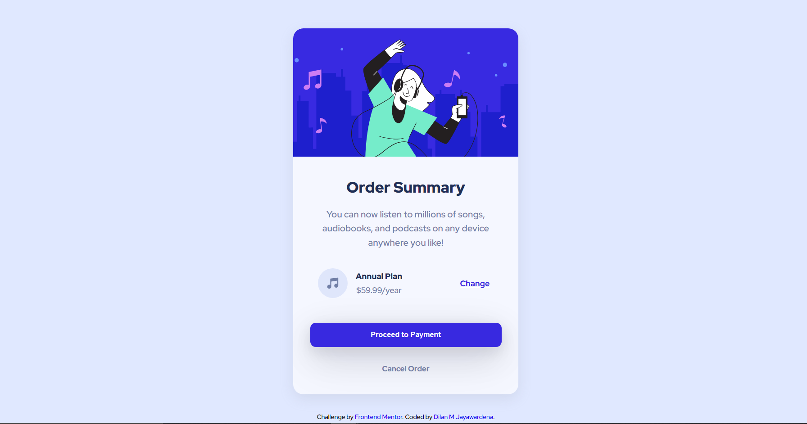
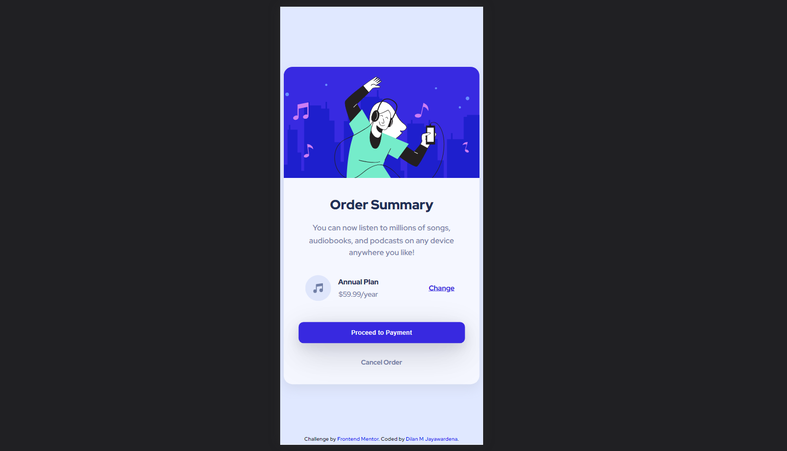

# Frontend Mentor - Order summary card solution

This is a solution to the [Order summary card challenge on Frontend Mentor](https://www.frontendmentor.io/challenges/order-summary-component-QlPmajDUj). Frontend Mentor challenges help you improve your coding skills by building realistic projects. 

## Table of contents

- [Overview](#overview)
  - [The challenge](#the-challenge)
  - [Screenshot](#screenshot)
  - [Links](#links)
- [My process](#my-process)
  - [Built with](#built-with)
  - [What I learned](#what-i-learned)
  - [Continued development](#continued-development)
  - [Useful resources](#useful-resources)
- [Author](#author)

**Note: Delete this note and update the table of contents based on what sections you keep.**

## Overview

### The challenge

Users should be able to:

- See hover states for interactive elements

### Screenshot

### Links
- Live Site URL: [here](https://iamdylanmj.github.io/Order-summary-card-/)

## My process

### Built with

- Semantic HTML5 markup
- Sass for styling
- Flexbox
- Drop shadows
- root selector

### What I learned
I used sass to so styling to this site and I gain more practice with Sass and how those selectors are used in Sass, specially how we can style our element using nested way of selector, it also help to maintain stylesheet more readable and less bugs.

### Continued development

I have some unclear stuffs regarding responsiveness of this simple card component, so I will be able to focus more attention to that part and in future I am planning to add more professional responsiveness to this simple card component.

### Useful resources

- [Box shadow values](https://getcssscan.com/css-box-shadow-examples) - This helped me for add beautiful  box shadows. I really liked this pattern and will use it going forward.
- [chatGPT](https://chat.openai.com/) - This is new A.I. tools helped me to clarify  some doubts regarding some  css rules.

**Note: Delete this note and replace the list above with resources that helped you during the challenge. These could come in handy for anyone viewing your solution or for yourself when you look back on this project in the future.**

## Author

- Frontend Mentor - [Dilan M Jayawardena](https://www.frontendmentor.io/profile/iamdylanmj)

